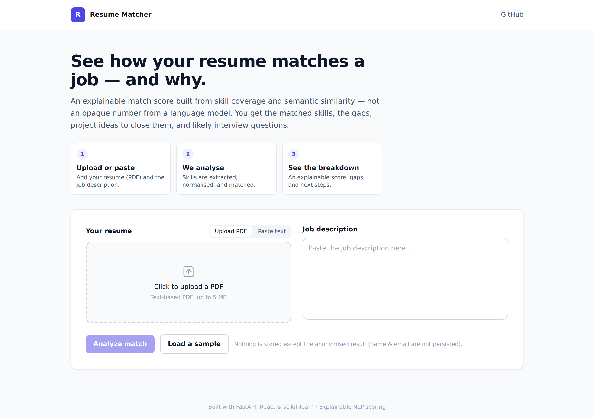
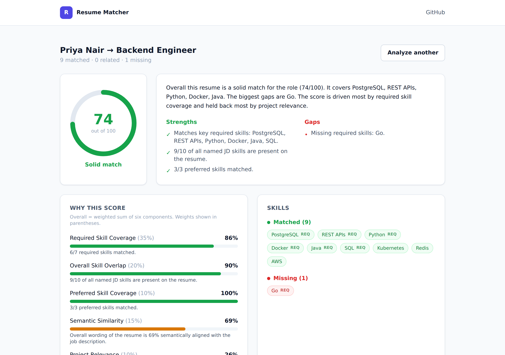
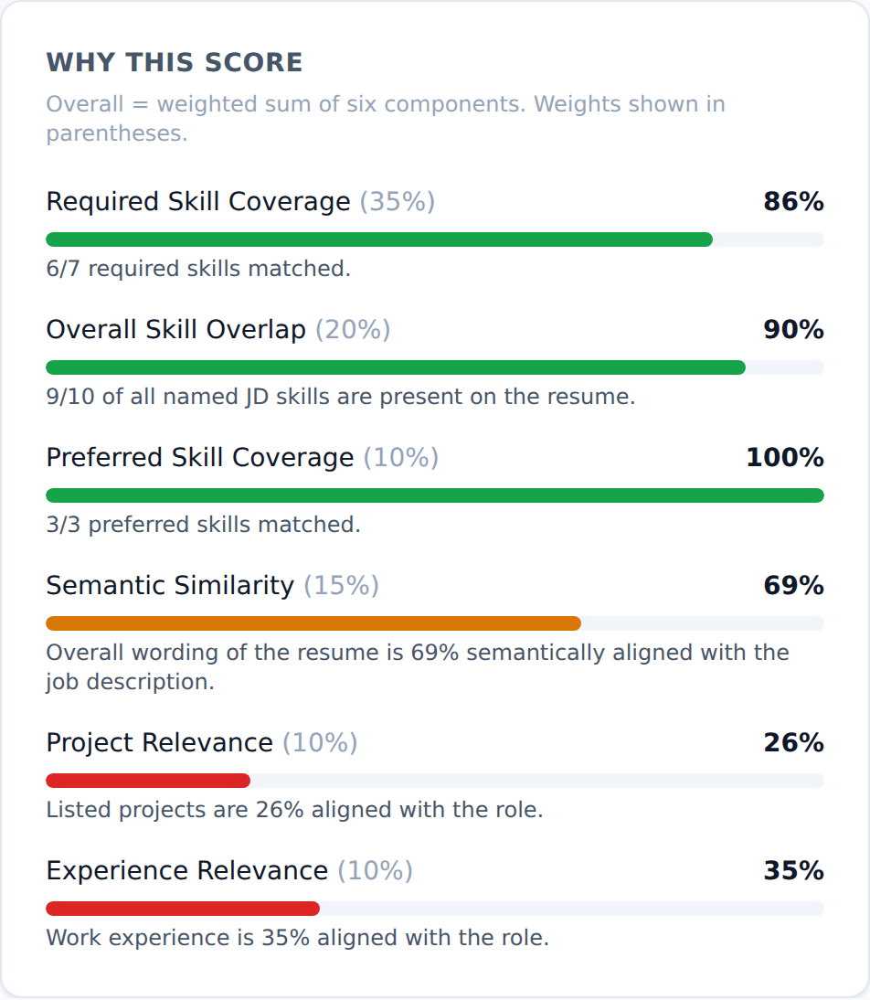
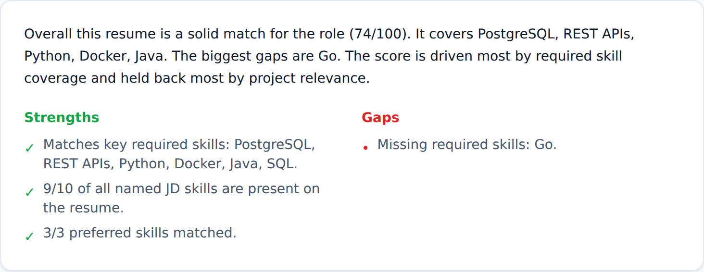
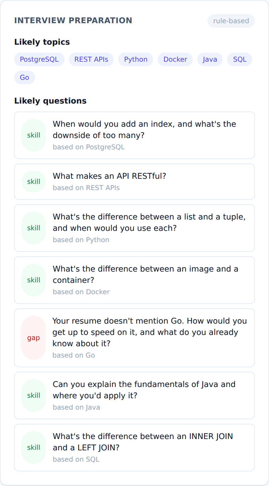

# AI Resume Analyzer & Job Matcher

An explainable resume-to-job matching system. Upload a resume (PDF) and paste a
job description; get a transparent match score, the matched and missing skills,
project ideas to close the gaps, and likely interview questions — with every
number traceable to concrete evidence.

The score is **not** a language model guessing "76/100". It is a weighted
combination of skill coverage and semantic similarity, computed deterministically
and broken down component by component. An LLM is used only, and optionally, to
phrase recommendations and interview questions — never to produce the score.

<p align="center">
  
</p>

## Contents

- [Problem](#problem)
- [Solution](#solution)
- [Key features](#key-features)
- [Screenshots](#screenshots)
- [Architecture](#architecture)
- [How it works](#how-it-works)
- [Scoring methodology](#scoring-methodology)
- [AI / ML methodology](#ai--ml-methodology)
- [Tech stack](#tech-stack)
- [Project structure](#project-structure)
- [Getting started](#getting-started)
- [Configuration](#configuration)
- [API](#api)
- [Testing](#testing)
- [Deployment](#deployment)
- [Limitations](#limitations)
- [Future improvements](#future-improvements)
- [Author & license](#author--license)

## Problem

Candidates apply to many roles and can't easily tell how well their resume fits a
specific job, or what to fix. Generic "AI resume scorers" hand back an opaque
number with no reasoning — useless for actually improving, and impossible to
defend. The hard part isn't producing *a* number; it's producing an **honest,
explainable** one.

## Solution

A pipeline that treats the problem as structured information extraction plus
transparent scoring:

1. Extract text from the resume PDF and split it into sections.
2. Extract and **normalise** skills on both sides against a curated taxonomy
   (so "psql", "Postgres" and "PostgreSQL" are one skill).
3. Separate the job's **required** vs **preferred** skills.
4. Match with three signals: exact, normalised, and semantic (a curated
   relatedness ontology plus embedding similarity).
5. Combine six weighted components into an explainable score.
6. Generate grounded recommendations and interview questions (LLM optional).

## Key features

- **Explainable score** — six components, each with its own sub-score, weight,
  and one-line reason. No black box.
- **Skill normalisation** — a ~95-skill taxonomy maps surface forms to canonical
  names and categories.
- **Three-signal matching** — exact / normalised / semantic, with a relatedness
  ontology (e.g. PyTorch ↔ TensorFlow) that works even offline.
- **Required vs preferred** weighting — missing a required skill hurts more than
  missing a nice-to-have.
- **Grounded recommendations & interview prep** — built from the *actual* gaps,
  with a deterministic fallback when no LLM is configured.
- **Pluggable semantic engine** — TF-IDF baseline, transformer embeddings when
  available, chosen automatically.
- **Provider-agnostic LLM layer** — OpenAI or Anthropic, swappable, with template
  fallback so the app always works.
- **Robust errors** — scanned PDFs, empty inputs, oversized files, and LLM
  failures all return clean messages, never stack traces.
- **Tested** — 38 backend tests covering extraction, normalisation, matching,
  scoring, and the API.

## Screenshots

| Analysis dashboard | Score breakdown |
|---|---|
|  |  |

| Skills | Interview prep |
|---|---|
|  |  |

## Architecture

```
Browser (React + TypeScript)
        │  HTTP (JSON + multipart)
        ▼
FastAPI  ──►  analysis pipeline
   Resume PDF ─► extract ─► clean ─► sections ─► skills (normalised)
   Job desc   ─► clean ─► required/preferred ─► skills (normalised)
                          │
                          ▼
       matching (exact + normalised + semantic)
                          │
                          ▼
       scoring engine (6 weighted, explainable components)
                          │
                          ▼
       LLM layer (optional): recommendations, interview Qs, explanation
                          │
                          ▼
                 AnalysisResult (JSON)  ─► optional history store
```

Full write-up in [`docs/ARCHITECTURE.md`](docs/ARCHITECTURE.md).

## How it works

1. **PDF extraction** (`pdfplumber`) reads the text layer; scanned/image PDFs are
   detected and rejected with a helpful message.
2. **Cleaning** normalises whitespace, hyphenation, and bullets.
3. **Section detection** splits the resume into education / experience / projects
   / skills / etc. using heading rules; optional spaCy NER pulls the name.
4. **Skill extraction** matches text against the taxonomy with boundary-aware
   rules (so "ml" doesn't match inside "html", and bare "go" only counts in a
   list context), reporting each skill under its canonical name.
5. **JD parsing** splits required vs preferred regions by cue phrases.
6. **Matching** finds exact/normalised matches, then flags *related* skills via a
   curated ontology and/or embedding similarity.
7. **Scoring** combines six components (below) into a 0–100 score.
8. **LLM/template layer** produces recommendations and interview questions
   grounded in the real matched/missing skills.

## Scoring methodology

```
overall = 100 × Σ (weightᵢ × componentᵢ)
```

| Component | Weight | Measures |
|---|---|---|
| Required Skill Coverage | 0.35 | required skills matched |
| Overall Skill Overlap | 0.20 | all JD skills matched (exact) |
| Preferred Skill Coverage | 0.10 | preferred skills matched |
| Semantic Similarity | 0.15 | whole-document meaning overlap |
| Project Relevance | 0.10 | projects vs role |
| Experience Relevance | 0.10 | experience vs role |

Skill signals carry ~two-thirds; semantic signals one-third. Related (not exact)
skills earn partial credit. Details and the calibration rationale are in
[`docs/SCORING.md`](docs/SCORING.md).

## AI / ML methodology

- **Deterministic core, LLM leaf.** Extraction, normalisation, matching, and
  scoring are rule/vector based and unit-tested. The LLM only decorates results.
- **Skill normalisation** via a curated taxonomy (canonical names + categories +
  a relatedness ontology).
- **Semantic similarity** via TF-IDF (baseline) or sentence-transformer
  embeddings (`all-MiniLM-L6-v2`) with cosine similarity; the engine
  auto-selects and calibrates per backend.
- **LLM** (optional) for natural-language recommendations, interview questions,
  and explanations — always fed only real pipeline data to avoid hallucination.

A concept-by-concept teaching guide is in [`docs/CONCEPTS.md`](docs/CONCEPTS.md),
and a full interview guide is in `docs/INTERVIEW_GUIDE.md`.

## Tech stack

**Backend:** Python, FastAPI, pdfplumber, scikit-learn, NumPy, SQLAlchemy,
httpx, (optional) sentence-transformers + spaCy.
**Frontend:** React, TypeScript, Vite, Tailwind CSS.
**Infra:** Docker, docker-compose, PostgreSQL (optional), pytest.

Every dependency earns its place — see [`docs/CONCEPTS.md`](docs/CONCEPTS.md) for
the "why this technology" rationale.

## Project structure

```
ai-resume-analyzer-job-matcher/
├── backend/
│   ├── app/
│   │   ├── api/          # FastAPI routes (thin HTTP layer)
│   │   ├── core/         # config, errors, logging
│   │   ├── schemas/      # Pydantic request/response models
│   │   ├── services/     # pdf extraction, cleaning, resume/JD parsing, orchestration
│   │   ├── ml/           # taxonomy, skill extraction, embeddings, matching
│   │   ├── scoring/      # weights + explainable scoring engine
│   │   ├── llm/          # provider-agnostic client + recommendations + interview
│   │   └── db/           # optional SQLAlchemy history
│   └── tests/            # pytest suite (38 tests)
├── frontend/             # React + TS + Tailwind
├── data/                 # synthetic sample resumes & job descriptions
├── docs/                 # architecture, scoring, concepts, interview guide
├── scripts/              # sample-PDF generator, screenshot capture
├── assets/screenshots/   # UI screenshots
├── docker-compose.yml
└── README.md
```

## Getting started

**Backend**

```bash
cd backend
python -m venv .venv && source .venv/bin/activate
pip install -r requirements.txt
# optional, for transformer embeddings:
pip install -r requirements-ml.txt && python -m spacy download en_core_web_sm
uvicorn app.main:app --reload --port 8000
```

**Frontend**

```bash
cd frontend
npm install
npm run dev     # http://localhost:5173
```

Or the whole stack with Docker: `docker compose up --build` → http://localhost:8080.
See [`docs/DEPLOYMENT.md`](docs/DEPLOYMENT.md).

## Configuration

Copy `.env.example` to `.env` and adjust. Everything has a default, so the app
runs with no configuration (LLM features fall back to templates). Key variables:
`CORS_ORIGINS`, `SEMANTIC_BACKEND`, `DATABASE_URL`, `LLM_PROVIDER`,
`LLM_API_KEY`.

## API

| Method | Path | Description |
|---|---|---|
| GET | `/api/health` | Health + capability flags |
| GET | `/api/skills` | The recognised skill taxonomy |
| POST | `/api/analyze` | Analyse a PDF resume + JD (multipart) |
| POST | `/api/analyze-text` | Analyse plain-text resume + JD (JSON) |
| GET | `/api/history` | Recent analyses (if history enabled) |

Interactive docs at `/docs` (Swagger UI) when the backend is running.

Example:

```bash
curl -X POST http://localhost:8000/api/analyze-text \
  -H "Content-Type: application/json" \
  -d '{"resume_text":"Python, SQL, PyTorch, FastAPI","job_description":"Required: Python, SQL. Preferred: Docker."}'
```

## Testing

```bash
cd backend
pip install -r requirements-dev.txt
python -m pytest        # 38 tests
```

Tests cover PDF extraction & validation, skill extraction/normalisation, JD
parsing, the matching engine, the scoring engine (including edge cases), and the
API endpoints.

## Deployment

Backend as a Docker container (Render / Railway / Fly), frontend as static hosting
(Vercel / Netlify), optional managed Postgres. Full instructions and a pre-deploy
checklist in [`docs/DEPLOYMENT.md`](docs/DEPLOYMENT.md).

## Limitations

- Skill recognition is limited to the curated taxonomy; skills outside it aren't
  matched (coverage measures *recognised* skills).
- Section detection uses heading heuristics and can miss unconventional layouts.
- Semantic components are strongest with the transformer backend; under the
  TF-IDF fallback they read lower (scores stay correctly ordered).
- Calibration bands are heuristic, not learned from a labelled dataset.
- No authentication or rate limiting (out of scope for this project).

## Future improvements

- Expand the taxonomy and load it from a data file / allow user-defined skills.
- Learn scoring weights and calibration from labelled resume–JD pairs.
- Add a lightweight learned skill tagger to catch out-of-taxonomy skills.
- Cache embeddings and add batch analysis.
- Export the analysis as a shareable PDF report.

## Author & license

Built by **Akhilesh** as a portfolio project. Licensed under the MIT License — see
[`LICENSE`](LICENSE).
